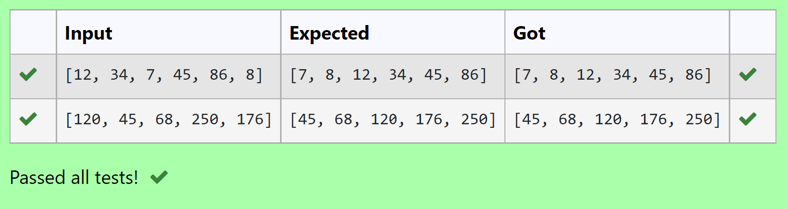

# Selection sort and Insertion sort
## Aim:
To write a program to perform selection sort and insertion sort using python programming.
## Equipment’s required:
1.	Hardware – PCs
2.	Anaconda – Python 3.7 Installation / Moodle-Code Runner
## Algorithm:
## Selection Sort Algorithm:
1.	Set the first unsorted element as the minimum
2.	For each of the unsorted elements, check if the element < current minimum.
3.	If yes, set the element as the new minimum.
4.	Swap minimum with first unsorted position.
5.	Repeat the steps 2 and 3 for all the elements in the array.
## Insertion Sort Algorithm:
1.	Set the first element as sorted element j.
2.	For each unsorted element X, check if current sorted element j >X.
3.	If yes, move sorted element to the right by 1.
4.	Break the loop and insert X.
5.	Repeat the steps 2 to 4 for sorting all the elements in the array.
## Program:
i)	#Selection Sort
```python 
Program for linear search method to match the item in a list
Developed by:  Mohamed Imthiyas M
RegisterNumber: 22005042

def linearSearch(array,n,k):
    for i in range(0,n):
        if array[i]==k:
            return i
    return -1
array = eval(input())
array.sort()
k = eval(input())
n = len(array)
result = linearSearch(array,n,k)
if result >=0:
    print(array)
    print("Element found at index: ",result)
else:
    print(array)
    print("Element not found")


```
ii)	#Insertion Sort
```python
Program to sort the elements in the list using the Insertion Sort algorithm.
Developed by: Mohamed Imthiyas M
RegisterNumber: 22005042

def insertion_sort(nums):
    for i in range(1,len(nums)):
        item = nums[i]
        j = i-1
        while j>=0 and nums[j]>item:
            nums[j+1] = nums[j]
            j-=1
        nums[j+1] = item
    return nums
list_of_nums = eval(input())
value = insertion_sort(list_of_nums)
print(value)


```

## Output:
Selection Sort:

Insertion Sort:


## Result:
Thus the program is written to perform selection sort and insertion sort using python programming.
